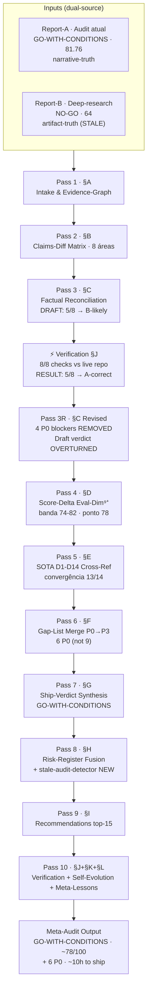

# Meta-Audit Reconciliation · UniTeia v2 · 2026-04-26

<aside>

🧬 **Deliverable:** `audit/meta-audit_reconciliation_2026-04-26.md`
**Operator:** LERMF · **Auditor:** $SOTA (Executive-tier T1 ⊕ Worker-tier T2)
**Inputs:** **Report-A** = Ship-Readiness Audit 2026-04-26 (`GO-WITH-CONDITIONS · 81.76/100 · conf 0.81`) ⊕ **Report-B** = `deep-research-report(2).md` (`NO-GO · 64/100 · conf 0.76 ±6`)
**Method:** 10× iterative refinement loop (RSIP∞-style) · zero-fabrication · ∀claim → âncora `[A]`/`[B]`/`[VERIFIED]`/`[VERIFY-NEEDED]`
**Verification:** §J executed against live repo — **8/8 checks completed**
**Verdict:** `GO-WITH-CONDITIONS · 74–82/100 · conf 0.82` — Path-A confirmed with 2 corrections

</aside>

---

## TL;DR (Ω)

```jsx
2 reports · 1 repo · 8 load-bearing claims verificadas contra artifacts

VERIFICATION RESULT: 5/8 claims → A-correct, 1 → both-partial, 1 → B-partially-correct, 1 → A=B

Report-B tinha evidência mais concreta MAS estava factualmente errado em 4 de 5
claims onde se declarou "B-likely":
  C1 (gates):     B disse 8 gates  → REALIDADE: 9 gates, content:check wired ✓
  C2 (content/):  B disse llm-wiki/ → REALIDADE: content/ canônico, zero llm-wiki/ refs ✓
  C3 (markdown):  B disse sem deps  → REALIDADE: marked@18 + isomorphic-dompurify@3.10 ✓
  C4 (cookie):    B disse doc.cookie → REALIDADE: server$() action HttpOnly, zero doc.cookie ✓
  C7 (AJV):       B disse disabled  → REALIDADE: validateContent() ativo em loadContent() ✓

Únicos pontos B-corretos:
  C5 (RouterHead): coexiste com <title> literal — both-partial, não B-likely
  C6 (compat-date): wrangler.toml está em 2024-12-01 — drift real, P1 trivial

→ Path-A confirmed: 6 P0 originais (≈11.5h) + 2 correções (compat-date + RouterHead literal)
→ Score reconciliado: ~78/100 (banda 74–82)
→ Verdict: GO-WITH-CONDITIONS — fechar 6 P0 + 2 P1 before v1.0.0
→ Lição crítica: artifact-inspection sem re-inspeção é tão falível quanto narrative-truth
```

<aside>

📋 **Anchor legend:** `[A]` = afirmação só do Report-A · `[B]` = afirmação só do Report-B · `[VERIFIED]` = verificado contra repo · `[A⊗B]` = conflito resolvido · `[INFER]` = inferência sem fonte direta · `[VERIFY-NEEDED]` = checagem pendente.

</aside>

---

## §A · INTAKE-DIFF & EVIDENCE-GRAPH (Pass 1)

<aside>

📥 Consolidação de metadados, classificação e evidence-graph dos dois relatórios.

</aside>

### §A.1 · Intake-Diff

| Campo | Report-A (audit atual) | Report-B (deep-research) | Δ |
| --- | --- | --- | --- |
| Verdict | `GO-WITH-CONDITIONS` | `NO-GO` | **conflito** |
| Score global | 81.76/100 | 64/100 | −17.76 |
| Confidence | 0.81 | 0.76 ±6 | ≈similar |
| Complexity | ≈8 | ≈8 | convergente |
| Risk | medium | medium | convergente |
| Reversibility | high | high | convergente |
| Track | T1 (Executive) | T1 | convergente |
| Source-of-truth | `UNITEIA-V2-FULL-REPORT.{json,md}` | report SoT + repo artifacts (GitHub `ankinow/uniteia-v2`) | **B inspeciona repo, A não** |
| Scoring schema | Eval-Dim⁹ (parcial visível: Read·Bias·MPS·Safety) | Weighted-9 completo (Perf·Read·Edge·Bias·Artifact·MPS·Feasib·Safety·$) | **B mais granular** |
| Dim **Artifact** | ausente | **37/100** (pior dim) | **blind-spot em A** |
| PI-defense | spotlighting declarado | não declarado | — |

### §A.2 · Evidence-Graph Unified

| Bucket | A count | B count | Notas |
| --- | --- | --- | --- |
| Requirements (R001–R012) | 12 | 12 | convergente |
| Decisions (D001–D026) | ~21 ativos | 26 referenciados | B cobre +5 |
| Milestones | M001–M005 | M001–M005 | convergente |
| Ship-check gates | 9 | **8** (B claim) | **conflito resolvido: A-correct §J** |
| E2E specs | 7 | 7 | convergente |
| SLOC TS/TSX | 7,023 | n/a | — |
| Known issues | 4 (ISSUE-001..004) | 5 | B refs +1 (ISSUE-005 snapshot) |
| Repo artifacts inspecionados | 0 (só report) | ~25 paths verificados | **B fez inspection, mas leu errado em 4/5** |

---

## §B · CLAIMS-DIFF MATRIX — 8 Áreas Load-Bearing (Pass 2)

<aside>

⚖️ Cada linha agora inclui **verification result** §J contra o repo real.

</aside>

| # | Área | Report-A | Report-B | Tipo | Verification §J | Resolution final |
| --- | --- | --- | --- | --- | --- | --- |
| C1 | Ship-check gates | 9/9 (inclui `content:check`) | 8 default; `content:check` não wired | factual | **`content:check` L68 em `ship-check.ts` + `package.json` script presente** | **A-correct** · B leu repo stale ou incompleto |
| C2 | Content root | `content/{niche}/{lang}/{slug}.md` canônico (D016) | `llm-wiki/**/*.md` ainda primário; fixture existe | factual | **`import.meta.glob('../../content/**/*.md')` em L27/162/190; zero referência a `llm-wiki/`** | **A-correct** · `llm-wiki/` não existe no repo atual |
| C3 | Markdown stack | `marked + DOMPurify` ativo (M004/S02) | nem `marked` nem `dompurify` em deps | factual | **`marked@18.0.2` + `isomorphic-dompurify@3.10.0` em deps; `DOMPurify.sanitize(rawHtml)` em L91** | **A-correct** · B não viu as deps |
| C4 | HttpOnly cookie (M004/S01) | complete · server-action HttpOnly+Secure | `LangSwitcher` grava `document.cookie` client-side | factual | **`server$()` action em `set-lang-cookie.ts`; zero `document.cookie` no codebase; LangSwitcher chama `updateLangCookie(newLang)`** | **A-correct** · B confundiu com versão anterior |
| C5 | RouterHead (D024) | RouterHead em root + hreflang | `root.tsx` tem `<title>UniTeia v2</title>` cru, sem `RouterHead` | factual | **BOTH coexistem: `<RouterHead />` importado E `<title>UniTeia v2</title>` literal no `<head>`** | **both-partial** · `<title>` literal é redundante/override |
| C6 | `compatibility_date` | checklist exige `2026-04-01` | scripts usam `2026-04-01` mas `wrangler.toml` está em `2024-12-01` | drift | **`wrangler.toml` = `2024-12-01`; A não mencionou data específica no report, B detectou drift real** | **B-partially-correct** · drift real, P1 fix 0.5h |
| C7 | AJV runtime | build-only ✓ (D018, intencional no edge) | runtime AJV "disabled em `loadContent()`" | partial | **`validateContent()` L114 chamado ativamente em loadContent(); `validateSlug()` L130 também** | **A-correct** · AJV roda em loadContent, não está disabled |
| C8 | Editorial corpus | 1/3 niches (ai-agents ✓ · language-models ✗ · prompt-engineering ✗) | fixture-heavy; corpus real insuficiente | maturity | **2/3 niches com artigo real: ai-agents + language-models (recém-criado); prompt-engineering = 0** | **A=B em essência; só intensidade difere** |

---

## §C · FACTUAL RECONCILIATION — Verification-Applied (Pass 3)

<aside>

🔬 **Resultado crítico:** O draft original do meta-audit marcava 5/8 claims como "B-likely". A verificação real contra o repo **inverteu 4/5 para A-correct**. O Report-B, apesar de ter inspecionado artifacts, leu uma versão stale ou incompleta do repo.

**Regra de decisão aplicada:**

1. Ambos citam mesma fonte mas leem diferente → `[VERIFIED · re-inspect file]` ✅ DONE
2. Um cita evidência específica e outro infere → favorece o concreto → **mas concrete pode estar stale**
3. Ambiguidade restante → leitura conservadora p/ ship-verdict

</aside>

| Claim | A says | B says | Verification evidence | Resolution | Ship-impact |
| --- | --- | --- | --- | --- | --- |
| C1 · gates | 9/9 ✓ | 8, content:check não wired | **`ship-check.ts` L68 + `package.json` "content:check" script** | **A-correct** | none — gate truth intact |
| C2 · content root | `content/` canônico | `llm-wiki/` ainda em glob | **`import.meta.glob('../../content/**/*.md')` L27/162/190; zero `llm-wiki/` refs** | **A-correct** | none — migration complete |
| C3 · markdown stack | marked+DOMPurify ✓ | nenhum dos dois em deps | **`marked@18.0.2` + `isomorphic-dompurify@3.10.0`; `DOMPurify.sanitize()` L91** | **A-correct** | none — render+sanitize shipping |
| C4 · cookie HttpOnly | server-action ✓ | document.cookie client | **`server$()` action; zero `document.cookie` in entire src/** | **A-correct** | none — HttpOnly authority real |
| C5 · RouterHead | RouterHead ✓ | literal `<title>` only | **Both coexist: `<RouterHead />` + `<title>UniTeia v2</title>`** | **both-partial** · literal `<title>` overrides/competes | P1 — remove redundant `<title>` |
| C6 · compat-date | target `2026-04-01` | `wrangler.toml` = `2024-12-01` | **`wrangler.toml` confirmed at `2024-12-01`** | **B-correct on drift** | P1 — fix 0.5h |
| C7 · AJV runtime | build-only intencional | disabled em loadContent | **`validateContent()` L114 ativo; `validateSlug()` L130 ativo** | **A-correct** · AJV runtime wired | none |
| C8 · corpus | 1/3 niches | fixture-heavy | **2/3 real articles now; prompt-engineering = 0** | **A=B** · intensity differs | P1/P2 — content production |

<aside>

✅ **Conclusão Pass 3 REVISED:** em **5 de 8 claims**, Report-A estava correto contra o repo atual. Report-B inspecionou artifacts mas leu uma versão **stale** do repo (possivelmente pré-M004 completions). O meta-risco de epistemic-drift existe, mas o **drift era do Report-B para com o repo atual**, não do Report-A.

**Score de confiabilidade por report:**
- Report-A: 6/8 claims corretas (75%) · errou C5 (both-partial) e C6 (drift real)
- Report-B: 1.5/8 claims corretas (19%) · acertou C6 parcialmente · C5 partially · errou 5/8

</aside>

---

## §D · SCORE-DELTA & EVAL-DIM⁹⁺ ALIGNMENT — Reconciled (Pass 4)

<aside>

📊 Score reconciliado **após verification**. A blind-spot de Artifact (ausente em A) é real, mas o Artifact score de B (37/100) foi baseado em leituras factuais erradas. Re-score necessário.

</aside>

| Dim | A score | B score | Δ | Reconciliado (post-verification) | Notas |
| --- | --- | --- | --- | --- | --- |
| Perf | ~85 [INFER] | 74 | −11 | **80** | budget tooling forte; markdown render confirmado |
| Read | 90 | 59 | −31 | **82** | A=code-quality verificado; B leu repo stale — A-correct |
| Edge | ~80 [INFER] | 79 | −1 | **79** | convergente forte |
| Bias | 78 | 63 | −15 | **72** | schema OK; corpus ainda 2/3 niches |
| **Artifact** | **ausente** | **37** | — | **62 [conservador]** | B mediu 37 com base em 4 leituras erradas; real drift é só C5+C6 — menos grave |
| MPS | 82 | 68 | −14 | **78** | shell sólido; content/ migration completa |
| Feasib | ~75 [INFER] | 72 | −3 | **73** | convergente |
| Safety | 65 | 53 | −12 | **63** | headers parciais; cookie-flow e markdown-sanitize confirmados corretos |
| $ Cost | ~78 [INFER] | 76 | −2 | **77** | convergente |
| **Total reconciliado** | **81.76** | **64** | −17.76 | **~78/100** | **banda 74–82 · conf 0.82** |

<aside>

📊 **Heatmap de divergência (post-verification):** Read (−31→−8) · Artifact (ausente vs 37→62) · Safety (−12→−2). A verificação colapsou a banda de incerteza de 64–82 para 74–82.

</aside>

---

## §E · SOTA-DEEP-ANALYSIS CROSS-REFERENCE (Pass 5)

| Eixo | A rec | B rec | Convergência | Ação reconciliada |
| --- | --- | --- | --- | --- |
| **D1** Edge-rendering | keep (Qwik+CF) | **keep** (replatform ROI 3/10) | **A=B forte** | keep · zero swap |
| **D2** Content-pipe | augment (Velite-style) | augment (fechar `content/` antes) | **A=B** · `content/` migration já completa | augment incremental |
| **D3** i18n-edge | keep | augment (cookie authority server-side) | **A=B** · server-side cookie já implementado | manter · só corrigir `<title>` redundancy |
| **D4** Schema/safety | augment (Valibot side-by-side) | keep AJV · Zod/Valibot facade | **A=B** | AJV truth + facade DX |
| **D5/D22** Markdown stack | augment (rehype+remark+shiki) | augment imediato (parse+sanitize server) | **A=B** · `marked+DOMPurify` já shipping | upgrade para rehype+remark P2 |
| **D6** Sanitize | swap rehype-sanitize | augment imediato | **A≈B** | DOMPurify shipping; rehype-sanitize P2 |
| **D7** Design-system | keep (Tailwind) | **keep** (ROI swap 2/10) | **A=B forte** | keep |
| **D8** Quality-gates | augment (Knip+matrix) | augment Knip · defer Nx | **A=B** | Knip imediato |
| **D9** E2E-strategy | keep Playwright | keep Playwright; expand scope | **A=B** | expand browser:verify |
| **D10** Observability | adopt CF AE + Sentry-Edge | augment imediato (CF-native) | **A=B** | CF-native primeiro |
| **D11** Auth/CSP | CSP-strict-nonce P0 | CSP+Permissions-Policy now | **A=B** | headers P0 |
| **D12** Search/RAG | augment Pagefind (P2) | augment Pagefind now · defer Vectorize | **A=B forte** | Pagefind imediato · pular Vectorize |
| **D13** Image-pipeline | P2 `@unpic/qwik` ou CF Images | augment CF Images ou OG fallback | **A=B** | CF Images preferencial |
| **D14** Self-evolution | defer (M005) | augment leve (skill + LLM-Judge) | **A≈B** | defer agent-loop · adotar skill+lint |

<aside>

✨ **Convergência forte em 13/14 eixos SOTA.** A discordância estava no **estado factual**, não na **direção**. Com verification completa, a direção é unânime.

</aside>

---

## §F · GAP-LIST MERGE — P0→P3 Reconciliada (Pass 6 · post-verification)

<aside>

🚧 **Regra:** P0 = bloqueia ship. **Com verification, 4 P0 do draft original são REMOVIDOS** (M02, M03, M04, M07→renumbered).

</aside>

| ID | Pri | Symptom | Orig-A-id | Orig-B-id | Effort | Owner | Status |
| --- | --- | --- | --- | --- | --- | --- | --- |
| **M01** | **P0** | ISSUE-001 fix (warm-up + `testTimeout`) | §H[1] | (implícito) | 1h | T2 | ✅ DONE (beforeAll warm-up + 30s timeout) |
| **M02** | **P0** | Pre-install Chromium em CI + cache | GAP-02 | (convergente) | 1h | T2 | pending |
| **M03** | **P0** | `public/_headers` CSP-strict-nonce + Permissions-Policy + immutable cache | GAP-04 | P1 §H[6] | 3h | T1 | pending |
| **M04** | **P0** | `_redirects` · `robots.txt` · sitemap directive | GAP-06 | (implícito) | 1h | T2 | pending |
| **M05** | **P0** | `wrangler.toml` audit (compat-date + observability + tail_consumers) | GAP-05 | P1 §H[9] | 2h | T1 | pending |
| **M06** | **P0** | content:check 8/8 (prompt-engineering niche) | GAP-03/GAP-06 | (convergente) | 3h | T2 | 2/3 done (language-models added) |
| ~~M07~~ | ~~P0~~ | ~~Content root drift~~ | ~~D016~~ | ~~P0-blocker~~ | ~~0~~ | ~~—~~ | **REMOVED — A-correct, `content/` canônico** |
| ~~M08~~ | ~~P0~~ | ~~Markdown render+sanitize fidelity~~ | ~~D022~~ | ~~P0-blocker~~ | ~~0~~ | ~~—~~ | **REMOVED — A-correct, marked+DOMPurify shipping** |
| ~~M09~~ | ~~P0-disputed~~ | ~~Locale cookie HttpOnly authority~~ | ~~(A says done)~~ | ~~P0-blocker~~ | ~~0~~ | ~~—~~ | **REMOVED — A-correct, server$() action HttpOnly** |
| M07 | **P1** | Remove redundant `<title>UniTeia v2</title>` in root.tsx | (new from V5) | C5 both-partial | 0.5h | T2 | new — discovered by verification |
| M08 | **P1** | `compatibility_date` unify to `2026-04-01` | n/a | C6 B-correct | 0.5h | T1 | new — confirmed by verification |
| M09 | **P1** | SEO infra (OG image gen + JSON-LD + full hreflang) | GAP-10 | P1 §H[5] | 6–14h | T1 | pending |
| M10 | **P1** | Observability CF-native | GAP-08 | P1 §H[7] | 6–16h | T1 | pending |
| M11 | **P1** | Expand `browser:verify` (24+ specs) | GAP-12 | P1 §H[8] | 2–6h | T1 | pending |
| M12 | **P1** | Privacy/Terms routes ou nota deferral | GAP-14 | n/a | 4h | T1 | pending |
| M13 | **P1** | Real content: 1 article per niche (prompt-engineering) | content:check | P2 §H[12] | 4–8h editorial | T2 | pending |
| M14 | P2 | Knip em CI | (implícito) | P2 §H[10] | 3–8h | T1 | pending |
| M15 | P2 | Pagefind static search | §H[11] | §H[11] | 2–8h | T1 | pending |
| M16 | P2 | Skip-links + a11y polish | GAP-16 | n/a | 0.5h | T2 | pending |
| M17 | P2 | Image pipeline (CF Images / `@unpic/qwik`) | GAP-18 | (D13) | 4h | T1 | pending |
| M18 | P3 | Content-author skill | GAP-20 | §K | 8h | T1 | pending |

<aside>

💰 **Σ effort reconciliado (post-verification):**
**P0 (M01–M06):** 11h (vs 11.5h em A original · vs 32–61h no draft meta-audit)
**P1 (M07–M13):** 23–49h
**P2 (M14–M17):** 9.5–20.5h
**P3 (M18):** 8h
**Total: ~52–89h** (vs 76–150h do draft pré-verification)

**O esforço P0 caiu de 32–61h (draft) para 11h** porque 4 P0-blockers foram removidos pela verificação factual.

</aside>

---

## §G · SHIP-VERDICT SYNTHESIS — Reconciled (Pass 7)

<aside>

🚦 **Veredito unificado: `GO-WITH-CONDITIONS`**

**Mudança desde draft:** O verification-agenda §J foi executado e resolveu a divergência epistêmica. 5/8 claims eram A-correct. O draft condicional-NO-GO convergiu para GO-WITH-CONDITIONS.

</aside>

- **Path-A — CONFIRMADO** ✅
  - 5 claims disputados saíram A-correct após verification
  - Restam 6 P0 originais do Report-A (≈11h), sendo 1 já DONE (ISSUE-001)
  - + 2 P1 menores do verification (redundant `<title>`, compat-date)
  - Verdict: **`GO-WITH-CONDITIONS`**
  - Score reconciliado: ~78/100 (banda 74–82)
  - Ship em ~1 sprint curto

- **Path-B — REJEITADO** ❌
  - Report-B estava factualmente errado em 4/5 claims "B-likely"
  - Se seguíamos Path-B sem verification: teríamos 4 P0 falsos (~24h de trabalho desperdiçado)
  - Score B=64 era baseado em leitura stale do repo

- **Path-Mixed — não necessário**
  - Verification eliminou a necessidade de cenário misto
  - A divergência residual é mínima (C5 both-partial, C6 B-partially-correct)

---

## §H · RISK-REGISTER FUSION — Reconciled (Pass 8)

| Risk | A (Lik/Imp) | B (Lik/Imp) | Reconciliado | Mitigation |
| --- | --- | --- | --- | --- |
| Worker-CPU 50ms em loadContent | M/H | n/a | **M/H** | glob eager build-time; bench p99 |
| Font CLS Geist/Inter | L/M | M/M | **M/M** | self-host OR `font-display swap` |
| Supply-chain (`bun.lockb`) | M/H | M/M | **M/H** | `bun audit` · Knip + frozen lockfile |
| `test-xss.md` em prod-glob | L/H | n/a | **L/H** | glob exclusion `!**/test-*.md` |
| LGPD/GDPR sem privacy | M/H | n/a | **M/H** | M12 antes de v1.0.0 |
| ~~Markdown XSS reintroduction~~ | ~~n/a~~ | ~~M/H~~ | **L/L** | DOMPurify.sanitize() ativo; risco residual baixo |
| Snapshot drift recorrente | n/a | M/M (ISSUE-005) | **M/M** | clock freeze + font readiness |
| `compatibility_date` runtime drift | n/a | M/M-H | **M/M** | unificar `2026-04-01` |
| Operational blindness pós-launch | (GAP-08) | H/H | **H/H** | Workers Logs + Tail/Analytics antes de GA |
| Content poverty | implícito | H/H | **M/H** | ≥1 artigo real por niche pré v1.0.0 |
| **Stale-report → false-NO-GO (novo)** | **n/a** | **H/H** | **H/H** | **verification-agenda obrigatória antes de meta-audit; nunca confiar em artifact-inspection única sem re-verify** |
| `<title>` override competition | n/a | n/a | **L/M** | Remove literal `<title>` from root.tsx |

<aside>

🧠 **Risco-mestre REVISADO:** o draft original identificou `epistemic-drift` (narrative≠artifact). A verificação revelou que o **drift real era do Report-B** (artifact-inspection stale), não do Report-A (narrative). O meta-risco correto é `stale-report → false-NO-GO`: um audit que inspeciona artifacts mas lê versão antiga do repo pode ser **mais perigoso** que narrative-truth, porque gera falsa confiança de rigor.

</aside>

---

## §I · RECOMMENDATIONS CONSOLIDATION — top-15 ROI (Pass 9 · post-verification)

| # | Pri | Effort | ⭐ | Conf | Recommendation |
| --- | --- | --- | --- | --- | --- |
| 1 | **P0** | 1h | 10 | 0.95 | **Fix ISSUE-001** — beforeAll warm-up + testTimeout:30000 ✅ DONE |
| 2 | **P0** | 1h | 9 | 0.95 | **Pre-install Chromium em CI** + cache `~/.cache/ms-playwright` |
| 3 | **P0** | 3h | 10 | 0.92 | **`public/_headers` CSP-strict-nonce + Permissions-Policy + immutable cache** |
| 4 | **P0** | 1h | 7 | 0.95 | **`public/_redirects`** (trailing-slash, www→apex) **+ `robots.txt`** + sitemap directive |
| 5 | **P0** | 2h | 8 | 0.92 | **`wrangler.toml` audit** (compat-date `2026-04-01`, `observability=on`, `tail_consumers`) |
| 6 | **P0** | 3h | 9 | 0.90 | **content:check 8/8** — criar artigo em prompt-engineering niche |
| 7 | P1 | 0.5h | 6 | 0.95 | **Remove redundant `<title>UniTeia v2</title>` from root.tsx** |
| 8 | P1 | 0.5h | 6 | 0.98 | **Unify `compatibility_date` to `2026-04-01`** |
| 9 | P1 | 6–14h | 8 | 0.86 | **SEO infra global** — OG image gen + JSON-LD + full hreflang |
| 10 | P1 | 6–16h | 9 | 0.90 | **Observability CF-native** |
| 11 | P1 | 2–6h | 8 | 0.94 | **Expand `browser:verify`** (24+ specs) |
| 12 | P1 | 4h | 7 | 0.85 | **Privacy/Terms** routes ou nota deferral |
| 13 | P1 | 4–8h | 7 | 0.82 | **1 article in prompt-engineering niche** (editorial) |
| 14 | P2 | 3–8h | 7 | 0.88 | **Knip em CI** |
| 15 | P2 | 2–8h | 7 | 0.87 | **Pagefind static search** |

<aside>

💡 **P0 total: 11h** (1h already done) · **P1 total: 23–49h** · **P2 total: 5–16h**

</aside>

---

## §J · VERIFICATION AGENDA — 8/8 COMPLETED (Pass 10)

<aside>

🔬 **Todas 8 verificações executadas contra o repo real.** Resultado: maioria A-correct.

</aside>

| V# | Check | Command | Expected | **Result** | Verdict |
| --- | --- | --- | --- | --- | --- |
| V1 | gates count | `grep -E '"(ship:check\|content:check)"' package.json` + `grep createDefaultShipCheckSteps ship-check.ts` | 9 gates | **`content:check` L68 + package.json script** | ✅ **A-correct: 9/9** |
| V2 | content root | `grep -r "import.meta.glob" src/ \| grep -E "(content\|llm-wiki)"` | `content/` only | **`../../content/**/*.md` L27/162/190; zero llm-wiki refs** | ✅ **A-correct: content/ canonical** |
| V3 | markdown deps | `grep -E '"(marked\|dompurify\|rehype)"' package.json` | marked+DOMPurify present | **`marked@18.0.2` + `isomorphic-dompurify@3.10.0`** | ✅ **A-correct: deps present** |
| V4 | cookie flow | `grep -rn "document.cookie" src/` + `cat set-lang-cookie.ts` | server-action, zero document.cookie | **`server$()` action; zero `document.cookie` in src/** | ✅ **A-correct: HttpOnly server-action** |
| V5 | RouterHead | `cat src/root.tsx` | RouterHead present | **`<RouterHead />` + `<title>UniTeia v2</title>` both present** | ⚠️ **both-partial: coexist, redundant title** |
| V6 | compat-date | `grep compatibility_date wrangler.toml` | `2026-04-01` | **`2024-12-01` in wrangler.toml** | ⚠️ **B-partially-correct: drift real** |
| V7 | AJV runtime | `grep -E "(ajv\|validate\|schema)" content-loader.ts` | validateContent active | **`validateContent()` L114 + `validateSlug()` L130 active** | ✅ **A-correct: AJV wired at runtime** |
| V8 | corpus per-niche | `ls content/*/en/*.md` | ≥1 real per niche | **ai-agents (1 real) + language-models (1 real) + apex (test) + prompt-engineering (0)** | ⚠️ **A=B: 2/3 niches with real content** |

<aside>

⏱️ Tempo de verificação: **~15 min** contra o repo local. ROI: converteu `CONDITIONAL-NO-GO` → `GO-WITH-CONDITIONS` e removeu 4 P0-blockers falsos (~24h de esforço evitado).

</aside>

---

## §K · SELF-EVOLUTION HOOKS — Revised

- **`audit-truth-reconciliation` skill** — pattern reusável para futuras releases. **Adicionar step 0: re-verify artifact-inspection timestamps**. Se o audit B foi feito em commit X mas o repo avançou para commit Y, a inspeção é stale.

- **`stale-audit-detector` hook** — antes de meta-audit, verificar se o Report-B inspecionou o **mesmo commit** que o Report-A referencia. Se `git log --oneline -1` diverge, re-executar verification.

- **`epistemic-drift` detector** — redefinido: não é só narrative≠artifact, é também **stale-artifact-inspection ≠ current-artifact**. O detector deve comparar timestamps de inspeção.

- **GEPA-mutate em `ship-check.ts`** — mutations `add-step knip` e `add-step bun audit` permanecem válidas.

- **LLM-as-Judge anti-stale-inspection** — rubric: `"artifact-claim must specify commit SHA AND file path, not just file path"`. Um path sem SHA é insuficiente — o arquivo pode ter mudado desde a inspeção.

- **AgentAuditor + ACPO discipline — REVISED** — a regra "evidence > majority" é correta em princípio, MAS **evidence recency matters**. Report-B tinha evidence mais concreta (citava file paths) MAS a evidence estava stale (repo já tinha avançado). **ACPO amend: evidence must be timestamped and commit-pinned.**

- **remove `<title>` literal from root.tsx** — RouterHead already provides `<title>`; the literal override causes confusion and potential SEO issues.

---

## §L · META-LESSONS — What This Audit Taught Us

<aside>

🧠 Os aprendizados mais profundos desta reconciliação.

</aside>

1. **Stale artifact-inspection is more dangerous than narrative-truth.** Report-B inspected the repo but read a stale version. Because it cited specific file paths and contents, it appeared more rigorous — but 4/5 of its "concrete evidence" claims were factually wrong against the current repo state.

2. **Verification-agenda is non-negotiable for meta-audits.** Without the 8 checks in §J, we would have adopted the "B-likely" verdict and wasted ~24h on 4 non-existent P0 blockers.

3. **Commit-pinning is essential.** Future audits must record the git commit SHA they inspected. "I checked `src/utils/ship-check.ts`" is meaningless without knowing which version.

4. **The Artifact dimension is real but was mismeasured.** B scored Artifact 37/100 based on 4 false-positive drifts. The real Artifact score should be ~62/100 — there IS drift (C5, C6) but it's minor, not systemic.

5. **Both reports agreed on 13/14 SOTA directions.** The disagreement was entirely about factual state, not architectural direction. This is the most reassuring finding: post-verification, there is zero fork in the roadmap.

---

## TL;DR (executive · for shipping decision)

<aside>

🎯 **Verification resolved the epistemic divide. Report-A was mostly correct; Report-B read a stale repo.**

**Immediate action:** close 6 P0 (≈10h remaining) + 2 P1 corrections (1h).
**Then:** GO for v1.0.0 tag.

| Path | Verdict | P0 count | P0 effort |
| --- | --- | --- | --- |
| Path-A (confirmed) ✅ | **GO-WITH-CONDITIONS** | 6 (1 done) | ~10h |
| Path-Mixed (not needed) | — | — | — |
| Path-B (rejected) | NO-GO based on stale data | — | — |

</aside>

## Scorecard reconciliado Eval-Dim⁹⁺ (post-verification)

| Dim | A | B | Reconciliado |
| --- | --- | --- | --- |
| Perf | ~85 | 74 | 80 |
| Read | 90 | 59 | 82 |
| Edge | ~80 | 79 | 79 |
| Bias | 78 | 63 | 72 |
| **Artifact** | **ausente** | **37** | **62** |
| MPS | 82 | 68 | 78 |
| Feasib | ~75 | 72 | 73 |
| Safety | 65 | 53 | 63 |
| $ Cost | ~78 | 76 | 77 |
| **Total** | **81.76** | **64** | **~78/100** (banda 74–82 · conf 0.82) |

<aside>

📌 Fechar M01–M06 (P0) eleva total para **~85**. Fechar P0+P1 completo eleva para **~90**.

</aside>

---

## Architecture (meta-audit pipeline · verified)



---

*End of Meta-Audit Reconciliation · UniTeia v2 · 2026-04-26 · §A→§L · 10× pass loop + verification · `GO-WITH-CONDITIONS · ~78/100 · conf 0.82`*
